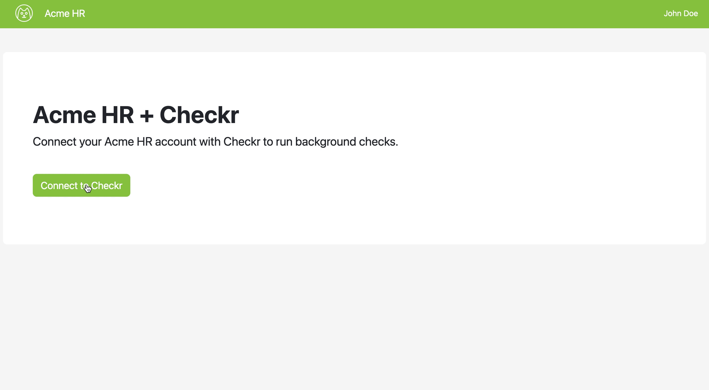

# Reference Integration

This is a sample application demonstrating an end to end Checkr integration. It
outlines best practices and patterns we see Checkr integrations adopt, and will
help you develop a Checkr certified integration. It focuses on two use-cases:

- How to use the
  [Checkr-Hosted Signup flow](https://docs.checkr.com/partners/#section/Getting-Started/Connect-your-customers-to-Checkr)
  to connect your customers to Checkr.
- How to order background checks and report results via
  [Checkr Embeds](https://docs.checkr.com/embeds).

You can refer to this application if you are building either one or both
use-cases.

 

 

# Contents

- [Live Sandbox](#live-sandbox)
- [Connecting customers](#connecting-customers)
- [Using Embeds to order background checks](#using-embeds-to-order-background-checks)
- [Resources](#resources)
- [Running it locally](#running-it-locally)
- [Got feedback?](#got-feedback)

## Live sandbox

An instance of this application is hosted at
[checkr-oauth-integration.herokuapp.com](https://checkr-oauth-integration.herokuapp.com).
It is connected to a demo staging Checkr account which does not run real
background checks.

You can also deploy this using your own Heroku account and connect it your
Checkr account.

## Connecting customers

With Checkr OAuth, your customers can easily connect their Checkr account with
your product. It gives your product the ability to make API calls on behalf of
your customers. This described in more detail in our
[partner guide](https://docs.checkr.com/partners/#section/Getting-Started/Connect-your-customers-to-Checkr).

#### Application components

| Component                                                                                                                                      | Responsibility                      | Code walkthrough                                                                     |
| ---------------------------------------------------------------------------------------------------------------------------------------------- | ----------------------------------- | ------------------------------------------------------------------------------------ |
| [oauth.js](https://github.com/checkr/oauth-reference-integration/blob/main/routes/oauth.js)                                                    | Handles OAuth and Webhooks          | [walkthrough](https://checkr-oauth-integration.herokuapp.com/docs/routes/oauth.html) |
| [CheckrConnectButton.js](https://github.com/checkr/oauth-reference-integration/blob/main/client/src/components/account/CheckrConnectButton.js) | Link to connect account with Checkr | [walkthrough](https://checkr-oauth-integration.herokuapp.com/docs/routes/oauth.html) |

```mermaid
sequenceDiagram
  autonumber

    Note right of App Frontend: CheckrConnectButton pressed
    Note right of Partner customer signup flow: Checkr Account created

    App Frontend->>+Partner customer signup flow: Navigate to Checkr Sign-Up Flow URL
    Partner customer signup flow->>+oauth.js: Navigate to redirect URL
    oauth.js->>+Checkr: Request OAuth Access token
    Checkr->>+oauth.js: Respond with OAuth Access token
    oauth.js->>+App Database: Persist and encrypt OAuth Access token in App Database
    oauth.js->>+App Frontend: Redirect to App Frontend

    Note right of App Frontend: Account is uncredentialed
    Checkr->>+oauth.js: Send account.credentialed webhook
    oauth.js->>+App Database: Update Checkr account state
    Note right of App Frontend: Account is credentialed

    App Frontend->>+Checkr: POST /oauth/deauthorize
    Checkr->>+oauth.js: HTTP 200
    Note right of Checkr: Token has been deauthorized
    oauth.js->>+App Frontend: HTTP 204
    Checkr->>+oauth.js: Send token.deauthorized webhook
    oauth.js->>+App Database: Delete access token from database
    Note right of App Frontend: Account is disconnected

```

## Using Embeds to order background checks

Embeds provide Javascript and React components to quickly build an experience to
order background checks and view results. Read more about it
[here](https://docs.checkr.com/embeds/).

#### Application components

| Component                                                                                                     | Responsibility                                 | Code walkthrough                                                                              | Diagram                                                                |
| ------------------------------------------------------------------------------------------------------------- | ---------------------------------------------- | --------------------------------------------------------------------------------------------- | ---------------------------------------------------------------------- |
| [session-tokens.js](https://github.com/checkr/oauth-reference-integration/blob/main/routes/session-tokens.js) | Handles requesting a Session token from Checkr | [walkthrough](https://checkr-oauth-integration.herokuapp.com/docs/routes/session-tokens.html) | [diagram](https://docs.checkr.com/embeds/images/authentication-v3.png) |

## Resources

- [API docs](https://docs.checkr.com)
- [Partner Guide](https://docs.checkr.com/partners)
- [Embeds docs](https://docs.checkr.com/embeds)

## Running it locally

View the [development page](docs/Developing.md) to run this project locally.

## Got feedback?

[Open an issue](https://github.com/checkr/oauth-reference-integration/issues) in
this repository to ask a question or give us feedback.
